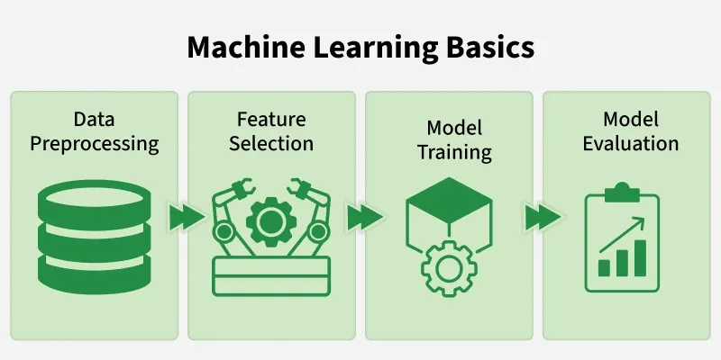
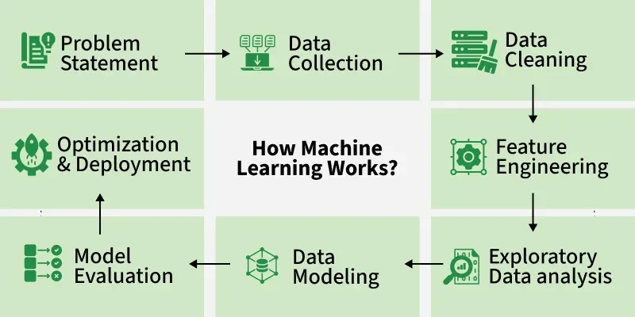
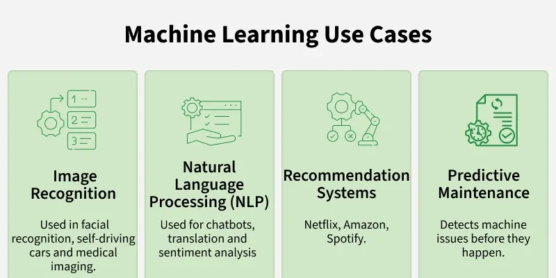

# 🤖 Machine Learning Roadmap

> *Complete guide from zero to ML practitioner — structured, detailed, and ready to follow.*
---

---

## 🗺️ The Big Picture

```
Math & Stats → Python → Data → ML Algorithms → Deep Learning → Deployment
```

Think of ML as building a smart system that **learns from data** instead of being explicitly programmed. This roadmap takes you through every layer.

---

## 📦 Phase 1 — Prerequisites

### 🔢 1.1 Mathematics

| Topic | What to Learn | Why It Matters |
|---|---|---|
| **Linear Algebra** | Vectors, matrices, dot product, eigenvalues | Neural nets are just matrix multiplications |
| **Calculus** | Derivatives, chain rule, partial derivatives | Gradient descent — the engine of ML |
| **Probability & Stats** | Distributions, Bayes' theorem, expectation | Models are fundamentally probabilistic |
| **Optimization** | Convex functions, minima, gradient | Training = solving an optimization problem |

> 💡 **Tip:** Don't over-study math before coding. Learn it alongside implementation.

---

### 🐍 1.2 Python for ML

```python
# The ML stack you must know
import numpy as np          # Arrays and math
import pandas as pd         # Data manipulation
import matplotlib.pyplot    # Visualization
import seaborn as sns       # Statistical plots
from sklearn import ...     # Classical ML
import torch / tensorflow   # Deep learning
```

**Core skills:**
- NumPy arrays, broadcasting, vectorization
- Pandas: DataFrames, groupby, merge, handling nulls
- Matplotlib & Seaborn: plotting distributions, correlations
- Jupyter Notebooks as your lab

---

## 📊 Phase 2 — Data Mastery

### 🗃️ 2.1 Data Collection & Types

- **Structured** — CSV, SQL tables (rows & columns)
- **Unstructured** — Images, text, audio
- **Semi-structured** — JSON, XML

Sources: Kaggle, UCI ML Repository, HuggingFace Datasets, web scraping

---

### 🧹 2.2 Data Preprocessing

```
Raw Data → Clean → Transform → Feature Engineer → Ready for Model
```

| Step | Techniques |
|---|---|
| **Missing Values** | Mean/median/mode imputation, KNN imputation, drop rows |
| **Outliers** | IQR method, Z-score, visualization |
| **Encoding** | One-hot encoding, label encoding, ordinal encoding |
| **Scaling** | StandardScaler (z-score), MinMaxScaler, RobustScaler |
| **Imbalanced Data** | SMOTE, oversampling, class weights |

---

### 🔍 2.3 Exploratory Data Analysis (EDA)

The art of **understanding your data before modeling.**

- Distribution plots (histograms, KDE)
- Correlation heatmaps
- Pairplots and scatter matrices
- Box plots for outlier detection
- Missing value heatmaps

> 🎯 **Goal:** Know your data better than your model does.

---

### ⚙️ 2.4 Feature Engineering

Creating better inputs for your model:

- **Interaction features** — multiply/combine columns
- **Binning** — convert continuous to categorical
- **Date features** — extract day, month, year, weekday
- **Text features** — TF-IDF, word count, sentiment
- **Dimensionality Reduction** — PCA, t-SNE, UMAP

---

## 🧠 Phase 3 — Classical Machine Learning

### 📐 3.1 Core Concepts First

```
Input (X) ──→ [ Model ] ──→ Output (ŷ)
                  ↑
           learns from (X, y)
```

**The ML Workflow:**
1. Split data → Train / Validation / Test
2. Choose a model
3. Train (fit)
4. Evaluate
5. Tune hyperparameters
6. Final test evaluation

---

### 📈 3.2 Supervised Learning

**Regression** — predicting a continuous value

| Algorithm | Best For | Key Idea |
|---|---|---|
| **Linear Regression** | Baseline, linear relationships | Fit a line to minimize MSE |
| **Ridge / Lasso** | Regularization | Penalize large coefficients |
| **Decision Tree** | Non-linear patterns | Split data on feature thresholds |
| **Random Forest** | Robust, tabular data | Ensemble of trees |
| **Gradient Boosting (XGBoost)** | Competitions, tabular | Trees built sequentially |
| **SVR** | Small datasets | Maximize margin |

**Classification** — predicting a category

| Algorithm | Best For |
|---|---|
| **Logistic Regression** | Binary, interpretable |
| **KNN** | Simple, small data |
| **SVM** | High-dimensional text |
| **Naive Bayes** | Text classification |
| **Random Forest** | General purpose |
| **XGBoost / LightGBM** | High performance tabular |

---

### 📉 3.3 Unsupervised Learning

No labels — find structure in raw data.

| Algorithm | Type | Use Case |
|---|---|---|
| **K-Means** | Clustering | Customer segmentation |
| **DBSCAN** | Clustering | Anomaly detection |
| **Hierarchical** | Clustering | Gene expression |
| **PCA** | Dimensionality Reduction | Visualization, compression |
| **Autoencoders** | Dimensionality Reduction | Feature learning |

---

### 📏 3.4 Model Evaluation

**For Classification:**
```
Accuracy    = correct / total
Precision   = TP / (TP + FP)   ← "of those predicted positive, how many were?"
Recall      = TP / (TP + FN)   ← "of all actual positives, how many found?"
F1 Score    = 2 × (P × R)/(P + R)
ROC-AUC     = area under the ROC curve
```

**For Regression:**
```
MAE  = mean absolute error
MSE  = mean squared error
RMSE = √MSE  (same units as target)
R²   = explained variance (1.0 = perfect)
```

---

### 🎛️ 3.5 Overfitting vs Underfitting

```
Underfitting           Just Right           Overfitting
(high bias)                                 (high variance)

  Training ↓               ↑↑                   ↑↑↑
  Validation ↓             ↑↑                   ↓↓

Fix: complex model    →    ✅             Fix: regularize/more data
```

**Techniques:** Cross-validation (k-fold), regularization (L1/L2), dropout, early stopping

---

### 🔧 3.6 Hyperparameter Tuning

- **Grid Search** — exhaustive, slow
- **Random Search** — faster, often as good
- **Bayesian Optimization** — smart, efficient (Optuna)

---

## 🧬 Phase 4 — Deep Learning

### 🕸️ 4.1 Neural Networks Fundamentals

```
Input Layer → [Hidden Layers] → Output Layer
   (X)          (features)         (ŷ)
```

**Key concepts:**
- **Neuron / Perceptron** — weighted sum + activation
- **Activation Functions** — ReLU, Sigmoid, Tanh, Softmax
- **Forward Pass** — compute predictions
- **Loss Function** — measure error
- **Backpropagation** — compute gradients
- **Gradient Descent** — update weights

**Optimizers:** SGD, Adam, AdaGrad, RMSProp

---

### 🖼️ 4.2 Convolutional Neural Networks (CNN)

**Best for:** Images, spatial data

```
Image → [Conv → Pool → Conv → Pool] → Flatten → FC → Output
```

| Layer | Purpose |
|---|---|
| Convolution | Detect local patterns (edges, textures) |
| Pooling | Reduce spatial size |
| Fully Connected | Classification/regression at the end |

**Famous architectures:** LeNet → AlexNet → VGG → ResNet → EfficientNet

---

### 📝 4.3 Recurrent Neural Networks (RNN/LSTM/GRU)

**Best for:** Sequences — text, time series, audio

- **RNN** — basic, suffers from vanishing gradients
- **LSTM** — Long Short-Term Memory, remembers long context
- **GRU** — lighter version of LSTM

Applications: Sentiment analysis, language modeling, stock prediction

---

### 🔄 4.4 Transformers & Attention

The architecture that **changed everything** (2017–present).

```
Input → Embedding → [Attention → FFN] × N → Output
```

**Self-Attention:** Every token looks at every other token.

**Famous models:**
- **BERT** — understanding (classification, NER)
- **GPT** — generation (text, code)
- **T5** — text-to-text everything
- **ViT** — vision transformers for images

---

### 🔧 4.5 Deep Learning Frameworks

| Framework | Strength | When to use |
|---|---|---|
| **PyTorch** | Research, flexibility | Most modern research & production |
| **TensorFlow / Keras** | Production, deployment | When you need TFServing or mobile |
| **JAX** | Speed, gradients | Research, Google ecosystem |

---

## 🌿 Phase 5 — Specialized ML Domains

### 💬 5.1 Natural Language Processing (NLP)

```
Text → Tokenize → Embed → Model → Output
```

Key tasks: Classification, NER, translation, summarization, Q&A

Libraries: `transformers` (HuggingFace), `spaCy`, `NLTK`

---

### 👁️ 5.2 Computer Vision (CV)

Key tasks: Image classification, object detection, segmentation, face recognition

Libraries: `OpenCV`, `torchvision`, `Detectron2`, `YOLO`

---

### 📈 5.3 Time Series

- Decomposition (trend + seasonality + noise)
- ARIMA / SARIMA — statistical baselines
- Prophet — Facebook's forecasting tool
- LSTM / Temporal Fusion Transformer — deep learning

---

### 🎮 5.4 Reinforcement Learning (RL)

```
Agent → takes Action → Environment changes → Agent gets Reward
       ←←←←←← learns to maximize reward ←←←←←←
```

Key concepts: State, Action, Reward, Policy, Q-value

Libraries: `stable-baselines3`, `Gymnasium`, `RLlib`

---

## 🚀 Phase 6 — MLOps & Deployment

### 🧪 6.1 Experiment Tracking

- **MLflow** — open-source, log metrics/params/artifacts
- **Weights & Biases (W&B)** — rich dashboards, collaboration
- **DVC** — data version control

---

### 📦 6.2 Model Serialization

```python
# Sklearn
import joblib
joblib.dump(model, 'model.pkl')

# PyTorch
torch.save(model.state_dict(), 'model.pt')

# ONNX — framework-agnostic
torch.onnx.export(model, ...)
```

---

### 🌐 6.3 Model Serving

| Tool | Use Case |
|---|---|
| **FastAPI** | Custom REST API |
| **Flask** | Lightweight API |
| **TorchServe** | PyTorch serving |
| **TFServing** | TensorFlow serving |
| **BentoML** | Multi-framework |
| **HuggingFace Spaces** | Quick demos |

---

### ☁️ 6.4 Cloud Platforms

- **AWS SageMaker** — full ML lifecycle
- **Google Vertex AI** — managed training + serving
- **Azure ML** — enterprise ML

---

### 🐳 6.5 Containerization

```dockerfile
FROM python:3.11-slim
COPY requirements.txt .
RUN pip install -r requirements.txt
COPY model/ .
CMD ["uvicorn", "app:app", "--host", "0.0.0.0"]
```

---

## 📚 Phase 7 — Advanced Topics

### 🔍 7.1 Explainability (XAI)

- **SHAP** — SHapley Additive exPlanations
- **LIME** — Local Interpretable Model-agnostic Explanations
- **Grad-CAM** — visual explanations for CNNs
- **Feature Importance** — tree-based models

---

### 🧬 7.2 Transfer Learning & Fine-Tuning

```
Pretrained Model (ImageNet/GPT) 
        ↓
Freeze early layers
        ↓
Fine-tune on your small dataset
        ↓
Fast + accurate with little data!
```

---

### ⚡ 7.3 Model Optimization

- **Quantization** — reduce precision (float32 → int8)
- **Pruning** — remove unimportant weights
- **Knowledge Distillation** — train small model to mimic large one

---

### 🤖 7.4 Large Language Models (LLMs)

- **Prompt Engineering** — zero-shot, few-shot, chain-of-thought
- **RAG** (Retrieval-Augmented Generation) — ground LLMs with your data
- **Fine-tuning** — LoRA, QLoRA, full fine-tune
- **Agents** — LLMs that use tools and plan

Libraries: `LangChain`, `LlamaIndex`, `Transformers`

---

## 🗓️ Suggested Learning Timeline

| Month | Focus |
|---|---|
| **Month 1–2** | Python, NumPy, Pandas, Math basics |
| **Month 3** | EDA, Preprocessing, Sklearn, Classical ML |
| **Month 4** | Model evaluation, Feature Engineering, Kaggle |
| **Month 5–6** | Deep Learning basics, PyTorch, CNNs |
| **Month 7** | NLP / CV based on your interest |
| **Month 8** | Deployment, FastAPI, Docker |
| **Month 9+** | Advanced topics, LLMs, RL, Research papers |

---

## 🛠️ Essential Tools & Libraries

```
Data:       numpy · pandas · scipy
Viz:        matplotlib · seaborn · plotly
Classical:  scikit-learn · xgboost · lightgbm
Deep:       pytorch · tensorflow · keras
NLP:        transformers · spacy · nltk
CV:         opencv · torchvision · albumentations
MLOps:      mlflow · wandb · dvc · docker
Deploy:     fastapi · bentoml · gradio · streamlit
```

---

## 📖 Best Resources

| Resource | Type | Best For |
|---|---|---|
| fast.ai | Course | Practical DL, top-down |
| Andrew Ng (Coursera) | Course | Foundations |
| StatQuest (YouTube) | Videos | Intuitive stats & ML |
| Hands-On ML (Géron) | Book | Sklearn + TensorFlow |
| Deep Learning (Goodfellow) | Book | Theory deep dive |
| Kaggle | Practice | Real datasets & competitions |
| Papers With Code | Research | SOTA models + code |
| HuggingFace | Library + Hub | NLP, CV, LLMs |

---

## ✅ Project Ideas by Level

### 🌱 Beginner
- House price prediction (regression)
- Titanic survival (classification)
- Iris flower classifier

### 🌿 Intermediate
- Movie recommendation system
- Sentiment analysis on tweets
- Image classifier (cats vs dogs)
- Customer churn prediction

### 🌳 Advanced
- Object detection (YOLO)
- Text summarization (T5/BART)
- Time series forecasting (electricity, stock)
- Build a RAG chatbot with your own docs

---

> 🎓 **Remember:** ML is 80% data work, 20% modeling. Master your data first, then the models will follow.

> 💪 **Consistency beats intensity.** 1 hour daily for a year beats 10 hours a week for a month.

---

*Generated with ❤️ for your ML journey*