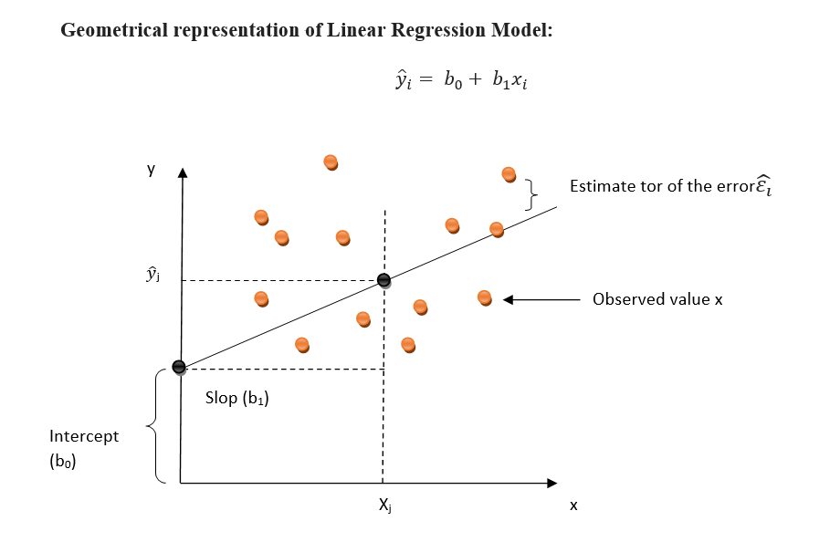
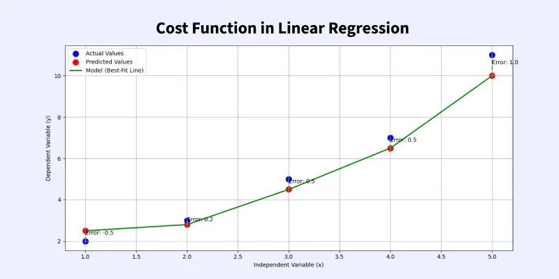
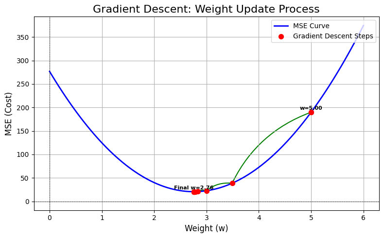
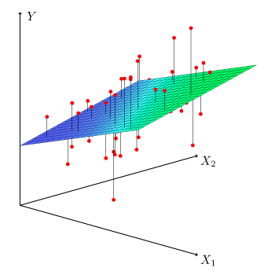

# 📊 Linear Regression — Complete Study Notes
### Section 27 · Understanding Complete Linear Regression In-Depth

---

## Table of Contents

1. [Simple Linear Regression — Introduction](#1-simple-linear-regression--introduction)
2. [Simple Linear Regression — The Equations](#2-simple-linear-regression--the-equations)
3. [Cost Function](#3-cost-function)
4. [Convergence Algorithm — Gradient Descent](#4-convergence-algorithm--gradient-descent)
5. [Convergence Algorithm — Part 2](#5-convergence-algorithm--part-2)
6. [Multiple Linear Regression](#6-multiple-linear-regression)
7. [Performance Metrics Overview](#7-performance-metrics-overview)
8. [MSE, MAE, and RMSE](#8-mse-mae-and-rmse)
9. [Overfitting and Underfitting](#9-overfitting-and-underfitting)
10. [Linear Regression with OLS](#10-linear-regression-with-ols)
11. [Simple Linear Regression — Practical](#11-simple-linear-regression--practical)
12. [Multiple Linear Regression — Practical](#12-multiple-linear-regression--practical)
13. [Polynomial Regression — Intuition](#13-polynomial-regression--intuition)
14. [Polynomial Regression — Implementation](#14-polynomial-regression--implementation)
15. [Pipeline in Polynomial Regression](#15-pipeline-in-polynomial-regression)
16. [Quick Reference Cheatsheet](#-quick-reference-cheatsheet)

---

## 1. Simple Linear Regression — Introduction

> **Definition:** Simple Linear Regression models the **linear relationship** between a single independent variable $x$ and a dependent variable $y$ by fitting the best possible straight line through observed data points.

### 🔑 Core Idea

The algorithm finds the *best-fit line* that minimises prediction errors across all data points. Every prediction is just a point on that line.

$$\hat{y} = \beta_0 + \beta_1 x$$

| Symbol | Name | Role |
|--------|------|------|
| $\hat{y}$ | Predicted output | What the model outputs |
| $\beta_0$ | Intercept / Bias | Where the line crosses the y-axis |
| $\beta_1$ | Slope / Coefficient | Rate of change of $y$ per unit $x$ |
| $x$ | Input feature | The single independent variable |

### 📌 Real-World Example

> **Predicting house price from size:**  
> $x$ = area in sq ft · $y$ = price in $  
> $\hat{y} = 50{,}000 + 150x$  
> A 1000 sq ft house → predicted price = **$200,000**

### ✅ Pros
- Extremely **interpretable** — every coefficient has a clear meaning
- **Fast** to train (closed-form or few iterations)
- Great **baseline model** before trying anything complex
- No hyperparameter tuning required (with OLS)

### ❌ Cons
- Only handles **one feature** — real problems rarely have just one
- Cannot capture **non-linear** patterns
- **Sensitive to outliers** — a few extreme values can skew the line significantly
- Assumes a **strict linear relationship** which often doesn't hold

---

## 2. Simple Linear Regression — The Equations

### The Line

$$\hat{y} = \beta_0 + \beta_1 x$$

### Optimal Coefficients via OLS

The **Ordinary Least Squares** solution gives the analytical, exact solution:

$$\boxed{\beta_1 = \frac{\displaystyle\sum_{i=1}^{n}(x_i - \bar{x})(y_i - \bar{y})}{\displaystyle\sum_{i=1}^{n}(x_i - \bar{x})^2}}$$

$$\boxed{\beta_0 = \bar{y} - \beta_1\,\bar{x}}$$

Where $\bar{x}$ and $\bar{y}$ are the sample means of $x$ and $y$ respectively.

### Error / Residual

Each actual observation decomposes as:

$$y_i = \underbrace{\hat{y}_i}_{\text{predicted}} + \underbrace{\varepsilon_i}_{\text{residual error}}$$

$$\varepsilon_i = y_i - \hat{y}_i$$

> The line is chosen to make the **sum of squared residuals** as small as possible — hence *least squares*.

### Geometric Intuition


```
  y
  |          ● actual point
  |        ↑ ↑ residual (vertical distance)
  |      ● predicted (on line)
  |    /
  |   /  ← best-fit line minimises Σεᵢ²
  |  /
  | /
  |/_________________________ x
```

---

## 3. Cost Function

> **Definition:** The **Cost Function** $J(\beta_0, \beta_1)$ is a scalar measure of how *wrong* the model's predictions are across the entire training set. Training = minimising $J$.

### The Mean Squared Error Cost Function

$$J(\beta_0,\, \beta_1) = \frac{1}{2n} \sum_{i=1}^{n} \bigl(\hat{y}_i - y_i\bigr)^2$$

> The $\tfrac{1}{2}$ factor is purely for convenience — it cancels the 2 that appears when we differentiate, leaving cleaner gradient expressions.

### Why Not Just Sum the Errors?

Positive and negative errors cancel each other out. Squaring ensures:

| Property | Reason |
|----------|--------|
| Always **positive** | No cancellation of $+/-$ residuals |
| **Penalises large errors** more | $2^2 = 4$ but $4^2 = 16$ — non-linear penalty |
| **Differentiable** everywhere | Enables gradient-based optimisation |
| **Convex** (bowl-shaped) | Guarantees a single global minimum |

### Visualising the Cost Surface
---


```
  J(β₀, β₁)
      │
   ╲  │  ╱   ← High cost — bad parameters
    ╲ │ ╱
     ╲│╱
      ★ ← Minimum — optimal β₀, β₁
      │
```

For simple linear regression, $J$ forms a perfect convex paraboloid in the $(\beta_0, \beta_1)$ space — there is **always exactly one minimum**.

---

## 4. Convergence Algorithm — Gradient Descent

> **Definition:** Gradient Descent is an iterative first-order optimisation algorithm. It repeatedly nudges parameters **downhill** along the cost surface — in the direction of the **negative gradient** — until the minimum is reached.

### Parameter Update Rule

$$\beta_j \;\rightarrow\; \beta_j - \alpha \cdot \frac{\partial J}{\partial \beta_j} \qquad \text{(repeat until convergence)}$$

### Gradients for Simple Linear Regression

$$\frac{\partial J}{\partial \beta_0} = \frac{1}{n} \sum_{i=1}^{n} (\hat{y}_i - y_i)$$

$$\frac{\partial J}{\partial \beta_1} = \frac{1}{n} \sum_{i=1}^{n} (\hat{y}_i - y_i)\cdot x_i$$

---


### 🧠 Ball-Rolling Intuition

> Imagine placing a ball on a hilly landscape (the cost surface). The ball always rolls in the **steepest downhill direction** and eventually settles at the **valley floor** (the minimum). The learning rate $\alpha$ controls how big each roll-step is.

### Effect of Learning Rate $\alpha$

| $\alpha$ | Behaviour | Risk |
|---------|-----------|------|
| Too **small** | Tiny steps, painfully slow convergence | Wasted compute |
| Too **large** | Giant steps, overshoots the minimum | Divergence |
| **Optimal** | Smooth, fast descent | None — ideal |

### Step-by-Step Algorithm

```
1. Initialise  β₀ = 0, β₁ = 0
2. Loop until convergence:
     a. Compute ŷᵢ = β₀ + β₁xᵢ  for all i
     b. Compute gradients ∂J/∂β₀ and ∂J/∂β₁
     c. Update simultaneously:
          β₀ ← β₀ - α · (∂J/∂β₀)
          β₁ ← β₁ - α · (∂J/∂β₁)
3. Return β₀, β₁
```

> ⚠️ **Simultaneous update** is critical — compute both gradients using the *old* values before updating either.

---

## 5. Convergence Algorithm — Part 2

### The Three Flavours of Gradient Descent

| Variant | Data per step | Speed | Noise level | Memory |
|---------|--------------|-------|-------------|--------|
| **Batch GD** | Full dataset | Slow per step, stable path | Very low | High |
| **Stochastic GD (SGD)** | 1 sample | Fast per step, noisy path | Very high | Minimal |
| **Mini-Batch GD** | 32 – 256 samples | Balanced | Medium | Moderate |

> **Mini-Batch GD** is the standard in practice — it benefits from vectorised GPU computation while still providing noisy enough gradients to escape shallow local minima.

### Convergence Criteria

Training stops when one of these conditions is met:

$$\bigl|J^{(t+1)} - J^{(t)}\bigr| < \epsilon \qquad \text{(cost change below tolerance)}$$

$$\bigl\|\nabla J(\boldsymbol{\beta})\bigr\| \approx 0 \qquad \text{(gradient near zero)}$$

$$t = T_{\max} \qquad \text{(maximum iterations reached)}$$

### Learning Rate Scheduling

> Instead of a fixed $\alpha$, decay it over training so large steps early on become fine-tuned smaller steps later.

**Step decay:**

$$\alpha_t = \alpha_0 \cdot \gamma^{\lfloor t / s \rfloor}$$

**Inverse decay:**

$$\alpha_t = \frac{\alpha_0}{1 + \text{decay} \cdot t}$$

### ⚠️ Common Problems & Fixes

| Symptom | Root Cause | Solution |
|---------|-----------|----------|
| Cost barely decreasing | $\alpha$ too small | Increase $\alpha$ or use adaptive optimizer |
| Cost oscillating / exploding | $\alpha$ too large | Reduce $\alpha$; use scheduling |
| Stuck in plateau | Saddle point or local min | Momentum, Adam, random restarts |
| Very slow on large datasets | Batch GD | Switch to Mini-Batch or SGD |

---

## 6. Multiple Linear Regression

> **Definition:** Multiple Linear Regression extends the simple case to **two or more independent variables**, modelling how a combination of features jointly predicts the target.

### Equation

$$\hat{y} = \beta_0 + \beta_1 x_1 + \beta_2 x_2 + \cdots + \beta_p x_p = \beta_0 + \sum_{j=1}^{p} \beta_j x_j$$

### Compact Matrix Form

$$\hat{\mathbf{y}} = \mathbf{X}\,\boldsymbol{\beta}$$

$$\mathbf{X} = \begin{bmatrix} 1 & x_1^{(1)} & x_2^{(1)} & \cdots & x_p^{(1)} \\ 1 & x_1^{(2)} & x_2^{(2)} & \cdots & x_p^{(2)} \\ \vdots & \vdots & \vdots & \ddots & \vdots \\ 1 & x_1^{(n)} & x_2^{(n)} & \cdots & x_p^{(n)} \end{bmatrix}, \quad \boldsymbol{\beta} = \begin{bmatrix} \beta_0 \\ \beta_1 \\ \vdots \\ \beta_p \end{bmatrix}$$

> The leading column of 1s in $\mathbf{X}$ is the **bias trick** — it absorbs $\beta_0$ into the matrix product cleanly.

---


### 📌 Example

> Predicting **house price** using three features:
> - $x_1$ = Area (sq ft)  · $x_2$ = Bedrooms  · $x_3$ = Distance from city (km)
>
> $$\hat{y} = 10{,}000 + 150\,x_1 + 8{,}000\,x_2 - 500\,x_3$$
>
> Each extra bedroom adds **$8,000**; each km from the city cuts **$500** off the price.

### ✅ Pros
- Captures **joint effects** of multiple variables
- Each coefficient has a clean **ceteris paribus** interpretation
- Forms the foundation of many advanced models

### ❌ Cons
- Assumes **no multicollinearity** — correlated features make coefficients unstable
- Still **linear** in features — misses curved relationships
- More features → higher overfitting risk without regularisation

### ⚠️ Five Key Assumptions (must check!)

1. **Linearity** — $y$ has a linear relationship with each $x_j$
2. **Independence** — observations are not correlated with each other
3. **Homoscedasticity** — variance of residuals is constant across $\hat{y}$
4. **Normality of residuals** — $\varepsilon_i \sim \mathcal{N}(0, \sigma^2)$
5. **No multicollinearity** — predictors are not highly intercorrelated

---

## 7. Performance Metrics Overview

> Performance metrics quantify **how well** the model fits training data and **generalises** to unseen data. Using only one metric can be misleading — always check several.

### $R^2$ — Coefficient of Determination

$$R^2 = 1 - \frac{SS_{\text{res}}}{SS_{\text{tot}}}$$

$$SS_{\text{res}} = \sum_{i=1}^{n}(y_i - \hat{y}_i)^2 \qquad SS_{\text{tot}} = \sum_{i=1}^{n}(y_i - \bar{y})^2$$

| $R^2$ | Interpretation |
|-------|----------------|
| $= 1.0$ | Perfect fit — model explains all variance |
| $0.8 - 0.99$ | Excellent |
| $0.6 - 0.79$ | Good |
| $0.4 - 0.59$ | Moderate |
| $< 0.4$ | Weak |
| $< 0$ | Model is **worse** than predicting the mean |

### Adjusted $R^2$ — Penalises Unnecessary Features

> Adding any feature, even a useless one, will increase plain $R^2$. Adjusted $R^2$ corrects for this.

$$\bar{R}^2 = 1 - \left(1 - R^2\right)\frac{n - 1}{n - p - 1}$$

Where $n$ = samples and $p$ = number of features.

> If adding a feature does **not** meaningfully improve fit, $\bar{R}^2$ will **decrease** — a clear signal that feature is junk.

## R² vs Adjusted R² (when to use)

### R² (Coefficient of Determination)
- Use when:
  - Comparing models with **same number of features**
  - You want a quick measure of **variance explained**
- Problem:
  - Always **increases when you add features** (even useless ones)

---

### Adjusted R²
- Use when:
  - Comparing models with **different number of features**
  - Doing **feature selection**
- Advantage:
  - Penalizes unnecessary features → **prevents overfitting illusion**

---

### When to use what
- Same features → **R²**
- Different features / feature selection → **Adjusted R²**

---

### Key Insight
- **R² = goodness of fit**
- **Adjusted R² = goodness of fit + penalty for complexity**
---

## 8. MSE, MAE, and RMSE

### Definitions & Formulas

**Mean Absolute Error (MAE)**

$$\text{MAE} = \frac{1}{n}\sum_{i=1}^{n} \bigl|y_i - \hat{y}_i\bigr|$$

**Mean Squared Error (MSE)**

$$\text{MSE} = \frac{1}{n}\sum_{i=1}^{n} \bigl(y_i - \hat{y}_i\bigr)^2$$

**Root Mean Squared Error (RMSE)**

$$\text{RMSE} = \sqrt{\text{MSE}} = \sqrt{\frac{1}{n}\sum_{i=1}^{n}(y_i - \hat{y}_i)^2}$$

### 📊 Head-to-Head Comparison

| Property | MAE | MSE | RMSE |
|----------|-----|-----|------|
| Unit | Same as $y$ | $y^2$ (squared) | Same as $y$ |
| Outlier sensitivity | **Low** — robust | **High** | **High** |
| Differentiability | Not at 0 | Everywhere | Everywhere |
| Interpretation ease | Very easy | Hard (different unit) | Easy |
| Penalises large errors | Linearly | Quadratically | Quadratically |

### 🔍 When to Use Which

> - Use **MAE** when your data has significant outliers and you don't want them dominating the metric (e.g., real-estate pricing, salary prediction).  
> - Use **RMSE** when large errors are especially costly and you want to penalise them heavily (e.g., medical dosage prediction, manufacturing tolerances).  
> - Use **MSE** mainly as the **training objective** (cost function) since it's differentiable everywhere.

### Worked Example

Given: $y = [3,\ 5,\ 2]$, $\hat{y} = [2.5,\ 5,\ 4]$

$$\text{Errors: } [0.5,\; 0,\; 2]$$

$$\text{MAE} = \frac{0.5 + 0 + 2}{3} = \mathbf{0.833}$$

$$\text{MSE} = \frac{0.25 + 0 + 4}{3} = \mathbf{1.417}$$

$$\text{RMSE} = \sqrt{1.417} \approx \mathbf{1.190}$$

---
## Why use MAE, MSE, RMSE

### 1. MAE (Mean Absolute Error)
- Use when:
  - You want **simple, interpretable error**
  - All errors should be treated **equally**
- Key point: Linear penalty → **robust to outliers**

---

### 2. MSE (Mean Squared Error)
- Use when:
  - You want to **penalize large errors more**
  - Useful for optimization (smooth, differentiable)
- Key point: Squaring → **sensitive to outliers**

---

### 3. RMSE (Root Mean Squared Error)
- Use when:
  - You want error in **same unit as target**
  - Still care more about large errors
- Key point: Interpretable like MAE but **keeps MSE penalty behavior**

---

## When NOT to use MAE, MSE, RMSE

### MAE — Avoid when:
- You need **differentiability everywhere** (MAE has non-smooth gradient at 0)
- You want to **penalize large errors more strongly**
- Optimization needs to converge faster (MAE can be slower)

---

### MSE — Avoid when:
- Dataset has **outliers** (gets dominated by large errors)
- You want **robust performance** instead of extreme sensitivity
- Error interpretability matters (unit becomes squared)

---

### RMSE — Avoid when:
- Outliers exist (same issue as MSE)
- You don’t want **over-penalization of large errors**
- Simpler metric (like MAE) is sufficient

---

### Summary
- **MAE** → equal penalty, robust  
- **MSE** → heavy penalty on large errors  
- **RMSE** → interpretable + penalizes large errors

---

## 9. Overfitting and Underfitting

### The Bias-Variance Tradeoff

The total expected error on any model decomposes as:

$$\text{Total Error} = \underbrace{\text{Bias}^2}_{\text{systematic error}} + \underbrace{\text{Variance}}_{\text{sensitivity to training data}} + \underbrace{\sigma^2}_{\text{irreducible noise}}$$

### Underfitting — High Bias

> **Definition:** The model is **too simple** to capture the true pattern. It makes large, consistent errors on both training and test data.

**Causes:** Too few features · Model too simple · Excessive regularisation

**Symptoms:**

- Training error: **High**
- Test error: **High**
- Training ≈ Test (both bad)

### Overfitting — High Variance

> **Definition:** The model **memorises** the training data, including its noise. It performs well on training data but fails badly on unseen data.

**Causes:** Too many features · Model too complex · Too little data

**Symptoms:**

- Training error: **Very low**
- Test error: **High**
- Big gap between training and test performance

### Visual Intuition

```
Underfitting           Good Fit               Overfitting
(degree = 1)          (degree = 3)           (degree = 15)

 *   *  *            *   * *  *               *.*.*.*.*.*
  \___/               ~smooth~                ~wiggly~
 straight line      follows trend         fits every noise point
```

### 🛠️ Remedies

| Problem | Remedy |
|---------|--------|
| Underfitting | Add polynomial features · Use more complex model · Reduce regularisation |
| Overfitting | **Regularisation** · Get more data · Feature selection · Cross-validation · Early stopping |

### Regularisation — Keeping Coefficients Small

**Ridge Regression (L2):**

$$J_{\text{ridge}}(\boldsymbol{\beta}) = \text{MSE} + \lambda \sum_{j=1}^{p} \beta_j^2$$

**Lasso Regression (L1):**

$$J_{\text{lasso}}(\boldsymbol{\beta}) = \text{MSE} + \lambda \sum_{j=1}^{p} |\beta_j|$$

| | Ridge (L2) | Lasso (L1) |
|-|------------|------------|
| Effect | Shrinks coefficients towards 0 | Can set coefficients to **exactly 0** |
| Feature selection | ❌ No | ✅ Yes (built-in) |
| Use when | All features matter | Many irrelevant features |

> $\lambda$ is the **regularisation strength** — a hyperparameter. Higher $\lambda$ = more shrinkage = simpler model.

---

## 10. Linear Regression with OLS

> **Definition:** Ordinary Least Squares (OLS) is a **closed-form analytical method** that finds the exact optimal $\boldsymbol{\beta}$ in a single computation — no iterative updates needed. It directly minimises $\sum \varepsilon_i^2$.
---
### Objective Function

$$
S(\beta_0, \beta_1) = \sum_{i=1}^{n} \left(y_i - (\beta_0 + \beta_1 x_i)\right)^2
$$

---

### Closed-form Solutions

$$
\beta_1 = \frac{\sum (x_i - \bar{x})(y_i - \bar{y})}{\sum (x_i - \bar{x})^2}
$$

$$
\beta_1 = \frac{n\sum x_i y_i - \sum x_i \sum y_i}{n\sum x_i^2 - (\sum x_i)^2}
$$

$$
\beta_0 = \bar{y} - \beta_1 \bar{x}
$$
---
### The Normal Equation

$$\boxed{\hat{\boldsymbol{\beta}} = \left(\mathbf{X}^{\top}\mathbf{X}\right)^{-1}\mathbf{X}^{\top}\mathbf{y}}$$

### Derivation (High-Level)

Start with the cost:

$$J(\boldsymbol{\beta}) = \|\mathbf{y} - \mathbf{X}\boldsymbol{\beta}\|^2$$

Expand and set the gradient to zero:

$$\frac{\partial J}{\partial \boldsymbol{\beta}} = -2\,\mathbf{X}^{\top}(\mathbf{y} - \mathbf{X}\boldsymbol{\beta}) = \mathbf{0}$$

$$\Rightarrow\; \mathbf{X}^{\top}\mathbf{X}\,\boldsymbol{\beta} = \mathbf{X}^{\top}\mathbf{y} \;\;\Rightarrow\;\; \hat{\boldsymbol{\beta}} = \left(\mathbf{X}^{\top}\mathbf{X}\right)^{-1}\mathbf{X}^{\top}\mathbf{y}$$

### OLS vs Gradient Descent

| Aspect | OLS (Normal Equation) | Gradient Descent |
|--------|----------------------|-----------------|
| Approach | Analytical, one shot | Iterative |
| Best for | Small–medium datasets | Large datasets |
| Complexity | $O(n^3)$ matrix inversion | $O(k \cdot n \cdot p)$ per epoch |
| Hyperparameters | **None** | Needs $\alpha$, iterations |
| Numerical issues | Fails when $\mathbf{X}^{\top}\mathbf{X}$ is singular | Robust to these |

### ⚠️ When OLS Breaks Down

$(\mathbf{X}^{\top}\mathbf{X})$ is **not invertible** when:
- Features are **perfectly correlated** (multicollinearity)  
- More features than samples ($p > n$)

**Fix:** Use **Ridge Regression** which adds $\lambda\mathbf{I}$ to guarantee invertibility:

$$\hat{\boldsymbol{\beta}}_{\text{ridge}} = \left(\mathbf{X}^{\top}\mathbf{X} + \lambda\mathbf{I}\right)^{-1}\mathbf{X}^{\top}\mathbf{y}$$

---

## 11. Simple Linear Regression — Practical

### Full Scikit-Learn Workflow

```python
import numpy as np
import matplotlib.pyplot as plt
from sklearn.linear_model import LinearRegression
from sklearn.model_selection import train_test_split
from sklearn.metrics import mean_squared_error, mean_absolute_error, r2_score

# ── 1. Data ───────────────────────────────────────────────────────────────────
X = np.array([600, 800, 1000, 1200, 1500, 1800, 2000]).reshape(-1, 1)
y = np.array([120, 160, 200,  240,  290,  340,  380])   # price in $K

# ── 2. Train / Test Split ─────────────────────────────────────────────────────
X_train, X_test, y_train, y_test = train_test_split(
    X, y, test_size=0.2, random_state=42
)

# ── 3. Train ──────────────────────────────────────────────────────────────────
model = LinearRegression()
model.fit(X_train, y_train)

# ── 4. Inspect Parameters ─────────────────────────────────────────────────────
print(f"Intercept  β₀ = {model.intercept_:.2f}")
print(f"Slope      β₁ = {model.coef_[0]:.4f}")

# ── 5. Evaluate ───────────────────────────────────────────────────────────────
y_pred = model.predict(X_test)
print(f"MAE  = {mean_absolute_error(y_test, y_pred):.2f}")
print(f"RMSE = {mean_squared_error(y_test, y_pred, squared=False):.2f}")
print(f"R²   = {r2_score(y_test, y_pred):.4f}")

# ── 6. Plot ───────────────────────────────────────────────────────────────────
plt.scatter(X, y, color='steelblue', label='Actual')
plt.plot(X, model.predict(X), color='crimson', label='Regression Line')
plt.xlabel("Area (sq ft)")
plt.ylabel("Price ($K)")
plt.legend()
plt.show()
```

### Key API Reference

| Attribute / Method | Returns / Action |
|--------------------|-----------------|
| `model.intercept_` | $\beta_0$ scalar |
| `model.coef_` | $[\beta_1, \beta_2, \ldots]$ array |
| `model.fit(X, y)` | Trains the model in-place |
| `model.predict(X)` | $\hat{y}$ array |
| `model.score(X, y)` | $R^2$ directly |

---

## 12. Multiple Linear Regression — Practical

```python
import pandas as pd
from sklearn.linear_model import LinearRegression
from sklearn.preprocessing import StandardScaler
from sklearn.model_selection import train_test_split, cross_val_score
import numpy as np

# ── Load Data ─────────────────────────────────────────────────────────────────
df = pd.read_csv("housing.csv")
X = df[["sqft", "bedrooms", "distance_km"]]
y = df["price"]

# ── Feature Scaling (important for gradient descent; not for OLS) ─────────────
scaler = StandardScaler()
X_scaled = scaler.fit_transform(X)  # fit ONLY on training data in production!

# ── Split → Train → Evaluate ─────────────────────────────────────────────────
X_train, X_test, y_train, y_test = train_test_split(
    X_scaled, y, test_size=0.2, random_state=0
)
model = LinearRegression()
model.fit(X_train, y_train)

print("Coefficients:", dict(zip(X.columns, model.coef_)))
print("R² (test):", model.score(X_test, y_test))

# ── Cross-Validation ──────────────────────────────────────────────────────────
cv_scores = cross_val_score(model, X_scaled, y, cv=5, scoring='r2')
print(f"CV R²:  {cv_scores.mean():.3f} ± {cv_scores.std():.3f}")
```

### Checking for Multicollinearity — VIF

```python
from statsmodels.stats.outliers_influence import variance_inflation_factor

vif_data = pd.DataFrame({
    "Feature": X.columns,
    "VIF": [variance_inflation_factor(X.values, i) for i in range(X.shape[1])]
})
print(vif_data)
# VIF > 10 → serious multicollinearity → consider dropping or combining features
```

### 💡 Practical Tips

- Always scale features when using **gradient descent**; OLS does not require it
- Check the **correlation matrix** (`df.corr()`) before modelling
- Use **cross-validation** — a single train/test split can be lucky or unlucky
- Interpret coefficients only when features are on the **same scale**

---

## 13. Polynomial Regression — Intuition

> **Definition:** Polynomial Regression adds **powered versions** of the input feature(s) to the design matrix, allowing a fundamentally non-linear curve to be fit — while the model remains **linear in its parameters** $\beta_j$ and can still be solved with OLS or gradient descent.

$$\hat{y} = \beta_0 + \beta_1 x + \beta_2 x^2 + \beta_3 x^3 + \cdots + \beta_d x^d$$

> 💡 **Key insight:** The model is non-linear in $x$ but linear in $\boldsymbol{\beta}$. This is why we call it a *linear* model — and why standard OLS still applies after the feature transform.

### When to Use Polynomial Regression

| Data Pattern | Recommendation |
|-------------|---------------|
| Curved, one inflection | Degree 2 (quadratic) |
| S-shaped, two inflections | Degree 3 (cubic) |
| Strictly straight | Degree 1 (plain linear) |
| Wildly complex | Consider tree-based models instead |

### Choosing the Degree — Bias-Variance View

$$\text{Degree} \uparrow \;\Longrightarrow\; \text{Variance} \uparrow, \quad \text{Bias} \downarrow$$

| Degree | Model | Typical Outcome |
|--------|-------|----------------|
| 1 | Linear | May **underfit** |
| 2 – 3 | Quadratic / Cubic | Often the sweet spot |
| ≥ 8 | Very flexible | Almost always **overfits** |

### 📌 Classic Example — Crop Yield vs Temperature

> Temperature has a non-linear effect on yield:  
> Too cold → poor growth · Optimal → peak yield · Too hot → stress, lower yield

$$\hat{y} = \beta_0 + \beta_1 T + \beta_2 T^2 \qquad (\beta_2 < 0 \text{ for a downward-opening parabola})$$

This **parabolic** relationship is captured perfectly by degree-2 polynomial regression.

---

## 14. Polynomial Regression — Implementation

### Step 1 — Transform Features with `PolynomialFeatures`

```python
from sklearn.preprocessing import PolynomialFeatures

poly = PolynomialFeatures(degree=2, include_bias=False)
X_poly = poly.fit_transform(X)   # X shape (n,1) → X_poly shape (n, 2)
```

#### What `PolynomialFeatures` Produces

**Single feature $x$, degree = 3:**

$$x \;\xrightarrow{\text{transform}}\; \bigl[x,\; x^2,\; x^3\bigr]$$

**Two features $[x_1,\, x_2]$, degree = 2:**

$$[x_1,\, x_2] \;\xrightarrow{\text{transform}}\; \bigl[x_1,\; x_2,\; x_1^2,\; x_1 x_2,\; x_2^2\bigr]$$

> ⚠️ **Feature explosion:** with $p$ features and degree $d$, the number of terms grows as $\binom{p+d}{d}$. Use with care.

### Full Example

```python
import numpy as np
import matplotlib.pyplot as plt
from sklearn.preprocessing import PolynomialFeatures
from sklearn.linear_model import LinearRegression
from sklearn.metrics import r2_score

# ── Generate non-linear data ──────────────────────────────────────────────────
np.random.seed(0)
X = np.linspace(0, 10, 100).reshape(-1, 1)
y = 3 + 2*X.ravel() - 0.4*X.ravel()**2 + np.random.randn(100) * 0.8

# ── Polynomial transform + fit ────────────────────────────────────────────────
poly  = PolynomialFeatures(degree=2, include_bias=False)
X_p   = poly.fit_transform(X)
model = LinearRegression().fit(X_p, y)

print(f"R²   = {r2_score(y, model.predict(X_p)):.4f}")
print(f"β₀   = {model.intercept_:.3f}")
print(f"β₁,β₂= {model.coef_}")

# ── Plot ──────────────────────────────────────────────────────────────────────
X_plot = np.linspace(0, 10, 300).reshape(-1, 1)
y_plot = model.predict(poly.transform(X_plot))

plt.scatter(X, y, alpha=0.5, label="Data")
plt.plot(X_plot, y_plot, color='red', label="Degree-2 fit")
plt.legend(); plt.show()
```

### Comparing Degrees Visually

```python
degrees = [1, 2, 3, 8]
for d in degrees:
    poly  = PolynomialFeatures(d, include_bias=False)
    X_p   = poly.fit_transform(X)
    model = LinearRegression().fit(X_p, y)
    r2    = r2_score(y, model.predict(X_p))
    print(f"Degree {d:2d} → R² = {r2:.4f}")
```

---

## 15. Pipeline in Polynomial Regression

> **Definition:** `sklearn.pipeline.Pipeline` chains multiple transformation and modelling steps into a **single estimator object** — ensuring that each step is fit on training data only, preventing data leakage and simplifying code.

### Why Pipelines Matter

| Without Pipeline | With Pipeline |
|-----------------|---------------|
| Manual transform on full dataset (data leakage!) | Transform fit only on training fold |
| Repetitive, error-prone code | Clean single `.fit()` / `.predict()` |
| Breaks inside cross-validation | Works seamlessly with CV & GridSearch |

### Building the Pipeline

```python
from sklearn.pipeline import Pipeline
from sklearn.preprocessing import PolynomialFeatures, StandardScaler
from sklearn.linear_model import LinearRegression

pipeline = Pipeline([
    ("poly",    PolynomialFeatures(degree=2, include_bias=False)),
    ("scaler",  StandardScaler()),
    ("model",   LinearRegression())
])
```

> Each step is a `(name, estimator)` tuple. The name is used to reference hyperparameters during tuning.

### Training & Evaluation

```python
from sklearn.model_selection import train_test_split, cross_val_score

X_train, X_test, y_train, y_test = train_test_split(
    X, y, test_size=0.2, random_state=42
)

pipeline.fit(X_train, y_train)
print("Test R²:", pipeline.score(X_test, y_test))

# Cross-validation — Pipeline handles fold-by-fold transforms correctly
cv_r2 = cross_val_score(pipeline, X, y, cv=5, scoring='r2')
print(f"CV R²: {cv_r2.mean():.3f} ± {cv_r2.std():.3f}")
```

### Hyperparameter Tuning — Find the Best Degree

```python
from sklearn.model_selection import GridSearchCV

param_grid = {
    "poly__degree":           [1, 2, 3, 4, 5],
    "model__fit_intercept":   [True, False]
}

grid = GridSearchCV(pipeline, param_grid, cv=5, scoring='r2')
grid.fit(X, y)

print("Best params:", grid.best_params_)
print("Best CV R²:", grid.best_score_)
```

> Access nested parameters with `stepname__paramname` syntax.

### Pipeline Data Flow

```
           X_train
              │
    ┌─────────▼──────────┐
    │  PolynomialFeatures│  fit_transform on train, transform on test
    │  x → [x, x², x³]   │
    └─────────┬──────────┘
              │  [x, x², x³]
    ┌─────────▼──────────┐
    │   StandardScaler   │  fit on train, scale both sets
    │  zero-mean, unit σ │
    └─────────┬──────────┘
              │  scaled features
    ┌─────────▼──────────┐
    │  LinearRegression  │  learns β₀, β₁, β₂
    └─────────┬──────────┘
              │
           ŷ = β₀ + β₁x + β₂x²
```

---

## 📋 Quick Reference Cheatsheet

| Concept | Formula |
|---------|---------|
| Simple LR | $\hat{y} = \beta_0 + \beta_1 x$ |
| Multiple LR | $\hat{y} = \beta_0 + \displaystyle\sum_{j=1}^p \beta_j x_j$ |
| Polynomial LR | $\hat{y} = \displaystyle\sum_{j=0}^d \beta_j x^j$ |
| OLS slope | $\beta_1 = \dfrac{\sum(x_i - \bar{x})(y_i - \bar{y})}{\sum(x_i - \bar{x})^2}$ |
| OLS intercept | $\beta_0 = \bar{y} - \beta_1\bar{x}$ |
| Normal equation | $\hat{\boldsymbol{\beta}} = (\mathbf{X}^\top\mathbf{X})^{-1}\mathbf{X}^\top\mathbf{y}$ |
| Gradient update | $\beta_j \leftarrow \beta_j - \alpha\,\dfrac{\partial J}{\partial \beta_j}$ |
| Cost (MSE form) | $J = \dfrac{1}{2n}\displaystyle\sum_i(\hat{y}_i - y_i)^2$ |
| MAE | $\dfrac{1}{n}\displaystyle\sum_i \|y_i - \hat{y}_i\|$ |
| MSE | $\dfrac{1}{n}\displaystyle\sum_i (y_i - \hat{y}_i)^2$ |
| RMSE | $\sqrt{\text{MSE}}$ |
| $R^2$ | $1 - \dfrac{SS_{\text{res}}}{SS_{\text{tot}}}$ |
| Ridge penalty | $J + \lambda\displaystyle\sum_j \beta_j^2$ |
| Lasso penalty | $J + \lambda\displaystyle\sum_j \|\beta_j\|$ |
| Bias-Variance | $\text{Error} = \text{Bias}^2 + \text{Variance} + \sigma^2$ |

---

> *Study notes compiled from Section 27 — Complete Linear Regression In-Depth*  
> *Cover: topics 141 – 155 · Simple LR · Multiple LR · Cost Functions · Gradient Descent · OLS · Regularisation · Polynomial Regression · Pipelines*