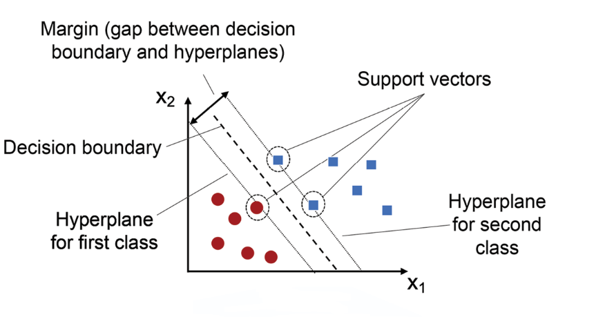

# Support Vector Machines 

---

## 182. Introduction to Support Vector Machine

- SVM is a **supervised learning algorithm** used for classification and regression.
- Core idea: find the **hyperplane** that best separates classes with the **maximum margin**.
- **Support vectors** = data points closest to the hyperplane; they alone determine its position.
- Works well in high-dimensional spaces and is effective when classes are clearly separable.
- Types:
  - **SVC** – Support Vector Classifier (classification)
  - **SVR** – Support Vector Regression (regression)
---


---

## 183. Soft Margin and Hard Margin

- **Hard Margin SVM**
  - Assumes data is perfectly linearly separable.
  - No misclassification allowed → very sensitive to outliers/noise.
- **Soft Margin SVM**
  - Allows some misclassification using **slack variables (ξ)**.
  - Controlled by regularization parameter **C**:
    - Large `C` → less tolerance for errors (narrow margin, risk of overfitting).
    - Small `C` → more tolerance for errors (wider margin, better generalization).
- Trade-off: **margin width vs classification error**.

---

## 184. SVM Maths Intuition

- Hyperplane equation:
  $$ w^T x + b = 0 $$
- Margin distance from a point to hyperplane:
  $$ \text{distance} = \frac{|w^T x + b|}{\|w\|} $$
- Objective: **maximize margin** = minimize `‖w‖`, i.e.
  $$ \min \frac{1}{2}\|w\|^2 $$
- Constraint (hard margin):
  $$ y_i(w^T x_i + b) \geq 1 \quad \forall i $$
- Margin width:
  $$ \text{Margin} = \frac{2}{\|w\|} $$

---

## 185. SVC Cost Function

- Uses **Hinge Loss**:
  $$ L = \max(0, 1 - y_i(w^T x_i + b)) $$
- Full soft-margin objective:
  $$ \min_{w,b} \frac{1}{2}\|w\|^2 + C \sum_{i=1}^{n} \max(0, 1 - y_i(w^T x_i + b)) $$
- **C** balances margin maximization vs error minimization.
- Hinge loss is 0 when point is correctly classified beyond margin; increases linearly otherwise.

---

## 186. Support Vector Regression (SVR)

- Goal: fit a function within an **epsilon-tube (ε)** around actual values, ignoring errors inside the tube.
- Objective:
  $$ \min \frac{1}{2}\|w\|^2 + C \sum (\xi_i + \xi_i^*) $$
  subject to:
  $$ |y_i - (w^T x_i + b)| \leq \varepsilon + \xi_i $$
- Only points **outside** the ε-tube become support vectors and contribute to loss.
- Parameters:
  - **ε** – width of the no-penalty zone.
  - **C** – penalty for points outside the tube.

---

## 187. SVM Kernels

- Used to handle **non-linearly separable data** by mapping to higher dimensions.
- **Kernel Trick**: compute dot products in high-dimensional space without explicit transformation.
- Common kernels:
  | Kernel | Formula | Use case |
  |---|---|---|
  | Linear | $K(x_i,x_j) = x_i^T x_j$ | Linearly separable data |
  | Polynomial | $K(x_i,x_j) = (x_i^T x_j + c)^d$ | Curved boundaries |
  | RBF (Gaussian) | $K(x_i,x_j) = e^{-\gamma \|x_i - x_j\|^2}$ | Most common, non-linear data |
  | Sigmoid | $K(x_i,x_j) = \tanh(\alpha x_i^T x_j + c)$ | Neural-network-like behavior |
- `gamma` controls influence of a single training point (high gamma = tighter fit, risk of overfitting).

---

## 188. Support Vector Classifiers

- Practical implementation of SVM for classification (`sklearn.svm.SVC`).
- Key hyperparameters:
  - `C` – regularization strength.
  - `kernel` – `'linear'`, `'poly'`, `'rbf'`, `'sigmoid'`.
  - `gamma` – kernel coefficient for `'rbf'`, `'poly'`, `'sigmoid'`.
  - `degree` – degree for polynomial kernel.
- Decision function based on sign of:
  $$ f(x) = w^T x + b $$
- Multi-class handled via **one-vs-one** or **one-vs-rest** strategy.

---

## 189. SVM Kernels Implementation

```python
from sklearn.svm import SVC
from sklearn.model_selection import train_test_split
from sklearn.preprocessing import StandardScaler

X_train, X_test, y_train, y_test = train_test_split(X, y, test_size=0.2, random_state=42)

scaler = StandardScaler()
X_train = scaler.fit_transform(X_train)
X_test = scaler.transform(X_test)

model = SVC(kernel='rbf', C=1.0, gamma='scale')
model.fit(X_train, y_train)

y_pred = model.predict(X_test)
```

- **Feature scaling is essential** for SVM (distance-based algorithm).
- Use `GridSearchCV` to tune `C`, `gamma`, and `kernel`.
- Compare kernels (`linear`, `poly`, `rbf`) on the same dataset to see decision boundary differences.

---

## 190. Support Vector Regression Implementation

```python
from sklearn.svm import SVR
from sklearn.preprocessing import StandardScaler

sc_X = StandardScaler()
sc_y = StandardScaler()
X_scaled = sc_X.fit_transform(X)
y_scaled = sc_y.fit_transform(y.reshape(-1, 1)).ravel()

regressor = SVR(kernel='rbf', C=100, epsilon=0.1, gamma='scale')
regressor.fit(X_scaled, y_scaled)

y_pred_scaled = regressor.predict(X_scaled)
y_pred = sc_y.inverse_transform(y_pred_scaled.reshape(-1, 1))
```

- Scale both `X` and `y` since SVR is sensitive to feature magnitude.
- Tune `epsilon` (tube width) and `C` (penalty) via cross-validation.
- Evaluate with **RMSE / R²**, not accuracy (regression task).

---